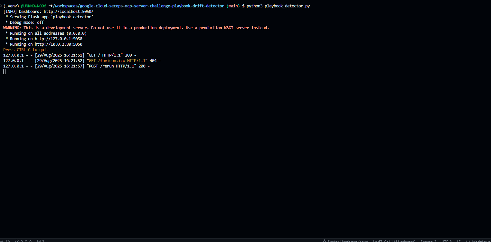

# MCP Playbook Drift Detector & Dashboard

## Overview

This project demonstrates a real-world security automation scenario using the Google SecOps MCP server. It features:
- A **mock MCP server** that serves and manages multiple realistic security playbooks.
- An **automated drift detector** that continuously checks for changes (drift) in playbooks compared to approved baselines.
- A **web dashboard** for visualizing drift status, viewing reports, and re-running checks with a single click.

---

## How It Works

1. **Mock MCP Server** (`mock_server.py`):  
   Simulates a real MCP server with REST endpoints for playbooks, audit logs, and alerts. Multiple playbooks are available, each representing a real security workflow.

2. **Drift Detector & Dashboard** (`playbook_detector.py`):  
   - Fetches playbooks from the MCP server.
   - Compares each to its local baseline.
   - Generates a drift report and sends an alert if drift is detected.
   - Provides a dashboard at [http://localhost:5050/](http://localhost:5050/) to view drift status and reports.

---

## Why This Matters

- **Before:** Manual, infrequent playbook reviews led to outdated automations and missed incidents.
- **After:** Automated drift detection keeps playbooks aligned and response sharp, with instant visual feedback.

---

## Usage Instructions

1. **Start the mock MCP server** in one terminal:
   ```sh
   python3 mock_server.py
   ```

2. **Start the drift detector/dashboard** in another terminal:
   ```sh
   python3 playbook_detector.py
   ```

3. **Open the dashboard** in your browser:
   ```sh
   $BROWSER http://localhost:5050/
   ```

4. **Simulate drift:**  
   Edit a playbook via the server or API, then click "Re-run" on the dashboard to see drift detection in action.

---

## Playbooks Included

- `default`: Login attempts monitoring and alerting
- `advanced`: Failed login escalation and user blocking
- `phishing_investigation`: Email parsing and threat intel checks
- `cloud_storage_audit`: GCP bucket audit and public access alerts
- `iam_anomaly_detection`: IAM change monitoring and anomaly detection
- `web_app_firewall_monitor`: WAF log analysis and SQLi blocking

---

## Screenshot

1. playbook_detector.py file execution in terminal
<<<<<<< HEAD

=======

>>>>>>> aee3f50 (FIles)

2. mock_server.py file execution in terminal

3. Dashbaord for playbook_detector.py

4. Dashboard for mock_server.py

---

## License

This project is provided for educational and demonstration purposes only
